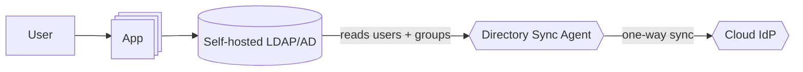
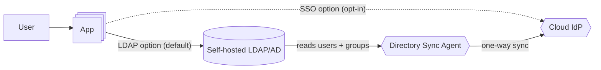
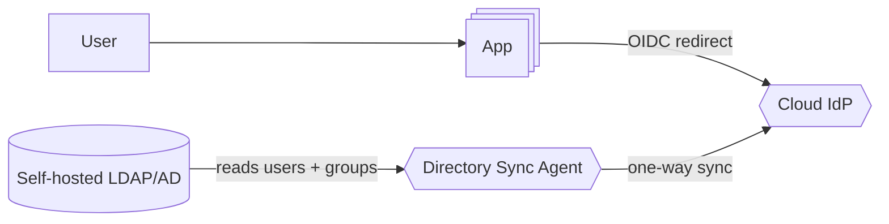

# Migration: App Login — LDAP/AD Simple-Bind to Cloud IdP SSO (OIDC)

Mock interview solution artifact for the scenario in [`objective.md`](./objective.md).

## Assumptions

1. **Cloud IdP stays generic.** Okta / Azure AD (Entra ID) / Google Workspace are interchangeable
   for this plan's purposes, matching the "e.g." in the objective. Where the real directory-sync
   mechanism differs by vendor (Okta AD Agent, Microsoft Entra Connect / Cloud Sync, Google Cloud
   Directory Sync), that's a swap-in detail, not a design decision.
2. **LDAP is never decommissioned.** Only the *app's direct* LDAP dependency (simple-bind +
   group queries on every login) goes away. The objective is explicit that LDAP remains the
   durable source of truth for other on-prem systems — directory sync is deployed once (phase 1)
   and stays in place through and after phase 4.
3. **MFA is out of scope.** The cloud IdP makes MFA trivial to add later, but the objective's
   intended state doesn't ask for it here — a natural fast-follow, not a success criterion for
   this migration.
4. **Authorization shape is unchanged.** The same group names/IDs should drive the same access
   decisions before and after — only the *source* of the group claim moves (LDAP query → OIDC
   token claim). Any group renaming/remapping introduced by the sync tooling is a defect to catch
   in validation, not an intended side effect.
5. **"Sessions must not all invalidate at once" → rolling, expiry-based cutover.** No forced mass
   logout at any point. LDAP-authenticated sessions ride out their natural TTL; phase 4 sets a
   hard sunset date so the tail doesn't drag indefinitely — bounded, but never instant.
6. **Rollout is a user-facing choice, not a feature flag.** Both login paths are exposed to
   *every* user at once via a login-method chooser rather than cohort targeting; "progressive"
   means *which option is the default button* (phase 3), not *who is allowed to see it*. Cost of
   that trade-off: no per-cohort staged exposure, so phase 2 reaches 100% of users on day one —
   deployment-level canarying (rolling the app build to a subset of instances/traffic, same as
   any other release) is the only risk-reduction lever left.

## Preflight

No infrastructure or app change — this is the checklist that confirms the assumptions above are
actually true before anything is touched. Topology is still
[the objective's existing infrastructure](./objective.md#existing-infrastructure).

- Inventory every other consumer of this LDAP instance by name (the objective states there are
  others).
- Dump the current LDAP schema: user attributes in use, group structure, nesting depth. This
  becomes the source-of-truth diff every later phase's sync validation is checked against.
- Confirm an outbound network path exists from wherever a directory-sync agent would run to
  LDAP (most sync agents are on-prem/outbound-only — don't assume no firewall change is needed).
- Capture the current session TTL/max-age config — phase 4's sunset date is only meaningful
  relative to this number.
- Confirm the app's current authorization logic: exactly which LDAP group attribute it reads and
  how group membership maps to permissions, so phase 2's claim mapping can be checked against it.

## Phase summary

| Phase | Topology change | User-facing change | Reversible? |
|---|---|---|---|
| 1 | + Directory Sync Agent, + Cloud IdP (populated, unused) | none | yes — nothing reads from the IdP yet |
| 2 | App exposes a login-method chooser | every user can pick LDAP or SSO; LDAP stays the default | yes — revert to a single login form |
| 3 | none (same components as phase 2) | SSO becomes the default option; LDAP demoted to a secondary "sign in another way" link | yes — swap the default back |
| 4 | LDAP option and its code path removed from the login screen | everyone authenticates via SSO; stale LDAP sessions get one final sunset deadline | no — point of no return for the app's LDAP code path (LDAP server itself is untouched) |

---

## Phase 1 — Establish directory sync (LDAP → IdP, one-way)

Pure plumbing: the IdP starts holding a mirror of identity/group data, and nothing authenticates
against it yet.

**Pre-validation**
- Dry-run the sync agent against a non-prod or scoped OU first; confirm it is read-only against
  LDAP (one-way, per the objective — a misconfigured bidirectional sync writing back to LDAP
  would affect every other consumer of this instance, not just this app).
- Confirm the sync agent's service-account credentials have the minimum LDAP read scope needed
  (bind + read on user/group OUs), not domain-admin-equivalent access.

**Post-validation**
- Reconcile: diff the full user/group set from the preflight dump against the IdP, attributes
  included — this dataset drives every phase after this one.
- Confirm sync latency/cadence is compatible with how quickly the org expects group-membership
  changes (e.g. offboarding) to take effect once phase 4 lands and the IdP is authoritative.
- Confirm nothing in the app or its auth path changed — this phase should be invisible to users;
  any observed behavior change here is a bug.

## Phase 2 — Login-method chooser: both paths available to everyone

The login screen offers both paths to 100% of users from the moment this ships, with LDAP still
presented as the default.

**Pre-validation**
- Confirm the OIDC client registration's requested scopes/claims actually return a group claim,
  and that its values match the group names captured in preflight name-for-name — this is the
  single most likely silent authorization regression in this whole migration.
- Confirm session issuance is unified: both paths must set the same cookie attributes/claims
  shape, or downstream code branches on "how did this session get created" and that branching
  outlives the migration as permanent tech debt.
- Since there's no user-level flag, the only staged-exposure lever left is the deployment itself
  — confirm the app release carrying this change can be canaried to a subset of instances/traffic
  the normal way, and that a canary failure is cheap to roll back.
- Confirm the chooser UI itself is unambiguous (which button is "the old way," which is SSO) —
  with no cohort restricting who sees it, a confusing screen becomes a support-ticket spike on
  day one, not a contained pilot-group problem.

**Post-validation**
- For a sample of real SSO logins: the redirect completes, the token validates (signature,
  issuer, audience, expiry), and the resulting session's effective permissions match what the
  same user would have gotten via LDAP (diff against the preflight baseline for those users).
- Confirm LDAP-path logins saw zero behavior change.
- Watch for a UX-driven support-load spike specific to this design: failed logins from users
  picking the unfamiliar option by mistake, or confusion about which credentials to use where.
  This category of signal didn't exist under a flagged-cohort design and is a direct consequence
  of exposing the choice to everyone at once.
- Rate-check the IdP's token endpoint isn't a new latency/availability dependency users notice.

## Phase 3 — Flip the default to SSO

Topology is identical to phase 2; only the emphasis inverts — SSO becomes the primary button,
LDAP a secondary "sign in another way" link, and both still work.

**Pre-validation**
- Confirm phase 2's real-world usage data (organic SSO adoption, error rate, claim-mapping
  accuracy) is healthy at whatever volume it received before biasing more traffic toward it.
- Confirm a comms/support-readiness plan exists for the default flip — users with muscle memory
  for the old primary button are the population most likely to be confused by this change,
  specifically because nothing was hidden from them before.
- Confirm the now-secondary LDAP option is still fully functional — don't let the de-emphasized
  path silently bit-rot before it's actually removed in phase 4.

**Post-validation**
- Measure the adoption shift: SSO's share of logins should rise measurably after the default
  flip — this is the confirmation that the nudge actually worked, not just that it shipped.
- Confirm no increase in failed logins or support tickets attributable to the flip itself.
- Re-run the phase-2 permission-parity check against the now-larger SSO population, not just the
  original organic adopters.

## Phase 4 — Full cutover: retire the app's direct LDAP dependency

The LDAP login option and the app's simple-bind + group-query code path behind it are removed;
LDAP itself and directory sync keep running for the other on-prem consumers, and any session
still on the old path gets one announced sunset deadline rather than an instant kill.

**Pre-validation**
- Confirm LDAP-path usage has dropped to a negligible floor (or a fixed calendar deadline has
  been reached and communicated) — a deliberate go/no-go against a pre-agreed threshold.
- Identify and individually resolve any remaining LDAP-only users before removing the option —
  e.g. service accounts, or edge-case devices/browsers that can't complete an OIDC redirect.
  Removing the choice entirely is only safe once no one is depending on it being there.
- Confirm the sunset deadline gives every remaining LDAP-session holder at least one full normal
  usage cycle to hit the app and get silently re-issued an SSO session before forced re-auth.
- Confirm removing the LDAP simple-bind *login* code path doesn't also remove or break LDAP
  *service-account* credentials the directory-sync agent (or anything else) still legitimately
  needs — this deletion should be scoped to the login/authz code, nothing else.

**Post-validation**
- LDAP simple-bind traffic from the app is zero — check LDAP's own bind logs/audit trail for
  this app's identifier, not just "the code was deleted so it must be zero."
- LDAP's other consumers (the preflight inventory) show unchanged traffic, confirming this app's
  removal didn't collaterally affect them.
- After the sunset deadline passes: no active session remains that was issued via the old path;
  every active session is traceable to an SSO login.
- Spot-check authorization outcomes one more time post-deletion — confirm the group-claim-based
  path alone (no LDAP fallback left in the code) still produces the same permissions as the
  preflight baseline.
