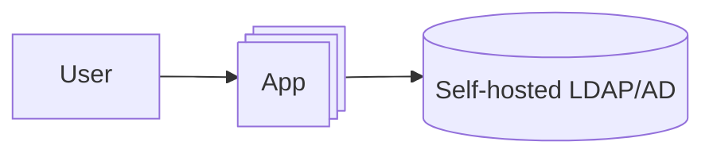
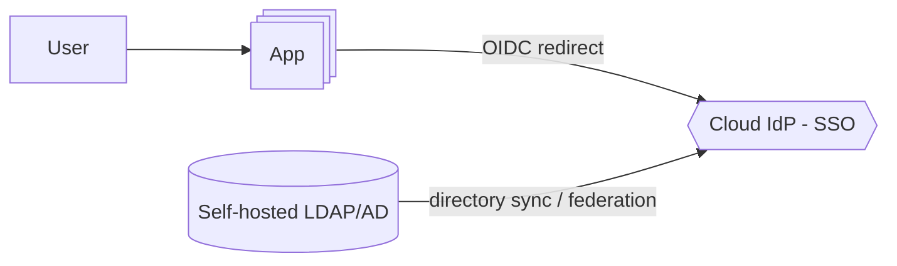

# Migration Scenario: App Login — Self-Hosted LDAP/AD to Cloud IdP SSO

## Objective

Migrate an application's authentication away from direct LDAP simple-binds against a
self-hosted LDAP/Active Directory instance, to SSO via a cloud-hosted Identity Provider
(e.g. Okta, Azure AD, Google Workspace) over OIDC.

# Existing Infrastructure

- On every login, `App` performs an LDAP simple-bind with the user's supplied credentials, then
  queries LDAP group membership to authorize the session.
- `LDAP` is a single self-hosted instance (or a primary/replica pair) that also backs other
  internal tooling beyond this app — it can't simply be decommissioned once this app cuts over.
- Sessions are cookie-based and sticky to whichever app instance issued them.
- There is no MFA today; LDAP only validates a password.

# Intended State

- `App` no longer talks to LDAP directly. Unauthenticated users are redirected to the IdP and
  the app accepts a signed OIDC token back.
- The cloud IdP is what users authenticate against going forward. LDAP remains in place as the
  durable source of truth for identity and group data, kept in sync via a one-way directory
  sync/federation agent, since other on-prem systems still depend on it directly.
- Group membership claims in the OIDC token drive authorization, replacing the app's LDAP group
  queries.
- Existing LDAP-authenticated sessions must not all invalidate at the same instant during
  cutover.
