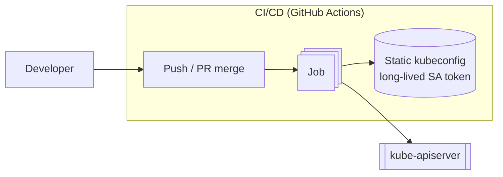
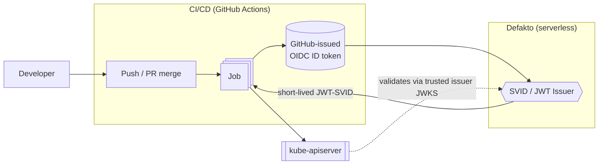

# Migration Scenario: CI/CD Kubernetes Auth — Static Kubeconfig to SVID

## Objective

Migrate a CI/CD deploy pipeline's authentication to the Kubernetes API server away from a
static, long-lived kubeconfig secret stored in CI, to short-lived SPIFFE JWT-SVIDs issued
on-demand by Defakto's serverless workload identity platform.

# Existing Infrastructure

- The pipeline is GitHub Actions. Every workflow run already receives a short-lived,
  repo/workflow-scoped OIDC ID token from GitHub for free (the `id-token: write` permission) —
  nothing uses it today.
- The credential in use is a long-lived Kubernetes ServiceAccount token (could also be a client
  certificate) stored as a GitHub Actions secret, bound to a single ClusterRole via a
  ClusterRoleBinding.
- `kube-apiserver` is a single managed control plane (e.g. EKS/GKE/AKS). You don't manage the
  control plane nodes, but you can change apiserver-level authentication config through the
  CSP's supported mechanism.
- Only a handful of workflows use this credential, but every deploy must apply cleanly or fail
  outright — a partially-applied manifest from an ambiguous auth failure is worse than a
  blocked deploy. We favor consistency over availability here.
- No external OIDC/JWT issuer is currently trusted by the API server for this pipeline.

# Intended State

- `Issuer` is Defakto's hosted SVID issuer — "serverless" in that there is no node agent or
  extra infrastructure to run or scale inside the cluster or the runner.
- Each workflow run exchanges its GitHub-issued OIDC ID token for a short-lived JWT-SVID scoped
  to that specific repo, workflow, and (ideally) environment/branch.
- `kube-apiserver` trusts Defakto as an additional external JWT/OIDC issuer and maps SPIFFE ID
  claims to the same RBAC subject the static kubeconfig used to satisfy — scoped narrowly enough
  that trusting Defakto for this pipeline doesn't implicitly trust it for every other subject in
  the cluster.
- No long-lived secret material remains in CI for this pipeline.
